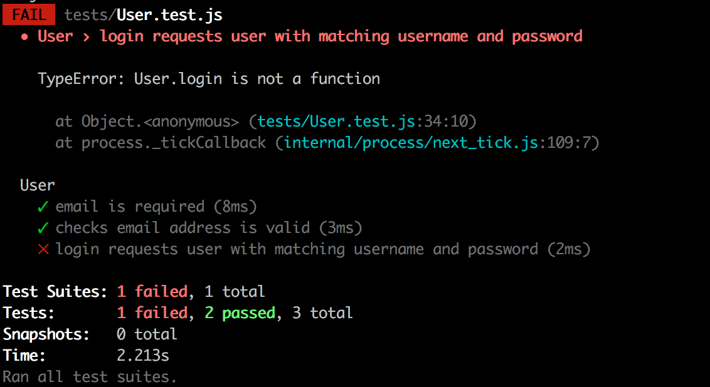

:twisted_rightwards_arrows: **Driver and Navigator switch roles if you haven't already done so**

## Static methods

Static methods are methods that are attached directly to the model, not an instance of the model. This is because they don't need access to a current instance's properties (through *this*) - they are merely *helper* methods. 

We will have static methods for `login` and `register` on our `User` model, that will abstract away some of the Mongoose querying from our controllers later on (we should try and shift as much application logic away from controllers as possible).

### Login - Test

1. Create a new test inside `User.test.js` for `login requests user with matching email address and password`.

2. Inside the callback function, call `spyOn`. Pass `User` as the first argument and `'findOne'` as the second argument. [Refresh your knowledge on spies](https://github.com/MCRcodes/course/blob/master/week7/lesson1_page5.md).

3. Next, create an object literal with properties `emailAddress` and `password`, and provide dummy (but valid) values. Assign it to variable `user`:

```js
var user = {
  emailAddress: 'hello@world.com',
  password: 'password123'
}
```

4. Create a new variable named `callback` and assign to it `jest.fn()`:

```js
var callback = jest.fn()
```

***
:bulb:

`jest.fn()` returns a mock - essentially an object that doesn't do anything. We can pass it into our code and assert against it later on, and Jest will know it's the same object.
***

4. Now call the `login` on `User`, and pass in arguments `user` and `callback` (notice we are calling `login` directly on `User`, as `login` is a static method).

5. `expect` `spy` `toHaveBeenCalledWith` `user` and `callback`:

```js
expect(spy).toHaveBeenCalledWith(user, callback)
```

6. Run your tests. You should fail with:



### Login - Passing the test

1. Inside `User.js`, underneath the `UserSchema` definition, assign an empty object literal to `UserSchema.statics`.

2. Inside the object literal, create a new method called `login`, which should have parameters `user` and `callback`.

3. Inside the `login` method, `return User.findOne(user, callback)`.

***
:bulb:

The reason we pass a callback to our `login` method is because the `findOne` method takes a callback, which we need access to in order to get data back from our collection. Because we set the callback to the callback we pass in, we are able to access the data outside of our `login` method.
***

4. Run your tests. They should pass.

***
:bulb:

In our test, we specify a `user`:

```js
var user = {
  emailAddress: 'hello@world.com',
  password: 'password123'
}
```

We pass this `user` to `User.login` as an argument, the `login` method assigns this argument to the parameter `user` and then passes that `user` parameter to `User.findOne` so the `login` method essentially returns the result of:

```js
User.findOne({
  emailAddress: 'hello@world.com',
  password: 'password123'
})
```

Remember, documents inside collections are of a JSON-like format. We can therefore query collections by passing in objects with matching property names.
***

### Register - Test

1. Create a new test inside `User.test.js` for `register inserts a user with email and password`.

2. Inside the callback function, call `spyOn`. Pass `User` as the first argument and `'insert'` as the second argument.

3. Next, create an object literal with properties `emailAddress` and `password`, and provide dummy (but valid) values. Assign it to variable `user`.

4. Create a new variable named `callback` and assign to it `jest.fn().

5. Now call the `register` method on `User`, and pass in arguments `user` and `callback`.

6. `expect` `spy` `toHaveBeenCalledWith` `user` and `callback`:

```js
expect(spy).toHaveBeenCalledWith(user, callback)
```
